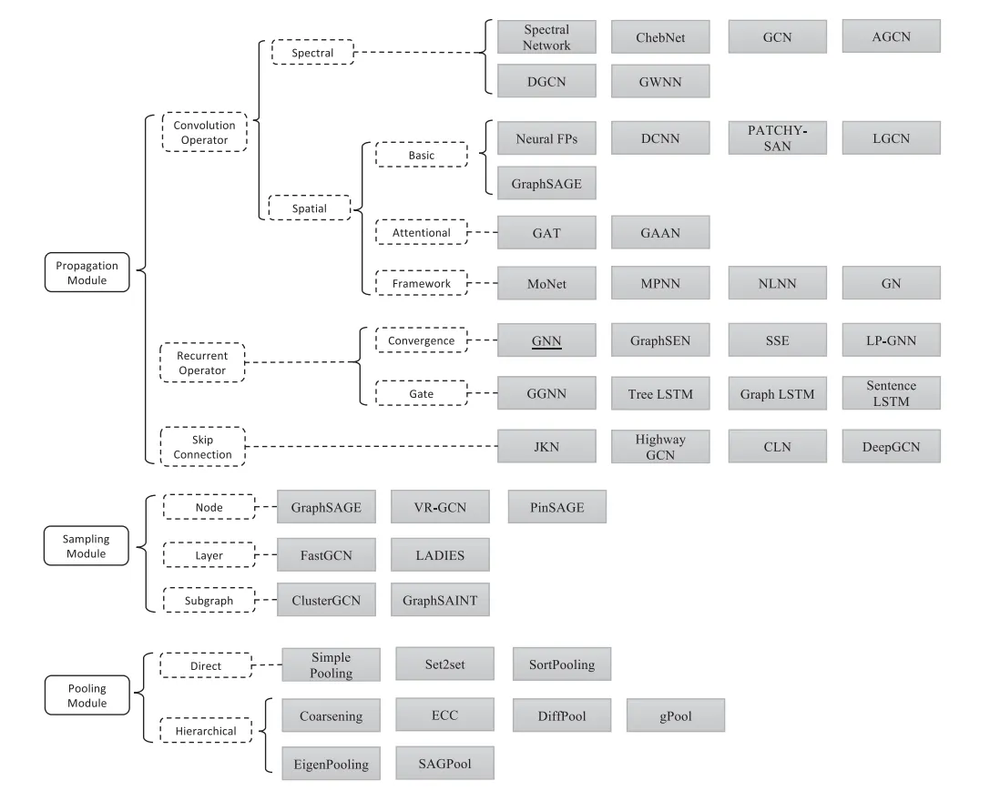
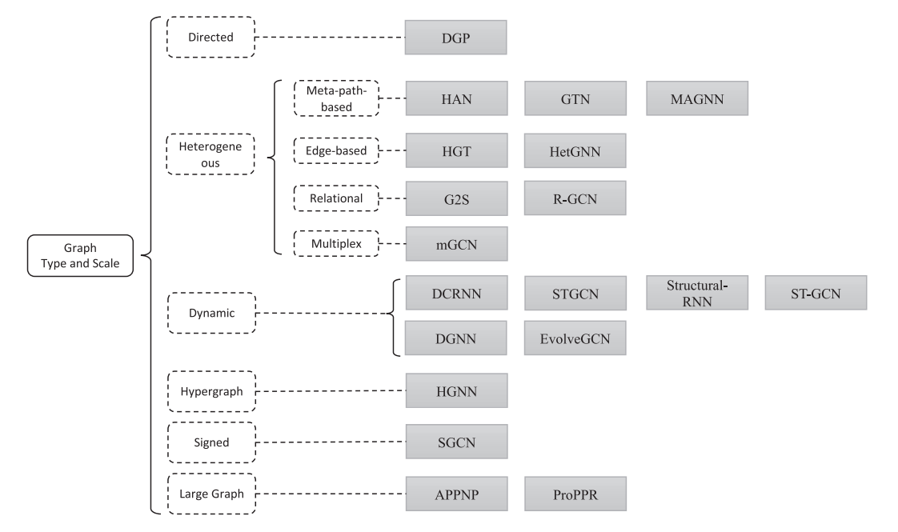

# 图神经网络:方法和应用综述

[文献地址](<https://www.sciencedirect.com/science/article/pii/S2666651021000012#sec2>)

## 1. GNN简介

图(graph)是一种数据结构，图神经网络(Graph Neural Network)应该是深度学习在图结构数据上的一些模型、方法和应用。

常见的图结构由节点(node)和边(edge)构成，节点包含了实体(entity)信息，边包含实体间的关系(relation)信息。现在许多学习任务都需要 **处理图结构的数据，比如物理系统建模(physics system)、学习分子指纹(molecular fingerprints)、蛋白质接口预测(protein interface)以及疾病分类(classify diseases)** ，这些都需要模型能够从图结构的输入中学习相关的知识。

文字：1D矩阵或者序列    一个词和下一个词是一条有向边

图片：2D矩阵  相邻像素之间连接边

图？ 实体（节点）之间的关系（边）（以及单个图的全局信息）

不同的信息都可以用不同长度的向量（embeding）表示

三个层面问题：
图：识别图结构，对结构进行分类
顶点：对点进行分类
边：通过顶点学习边的属性

### 1.1 GNN起源

GNN起源于两种动机，一种动机来自于**卷积神经网络(CNN)**，另一种动机来自于**图嵌入(graph embedding)**。

#### 1.1.1 动机一：CNN

CNN能够提取出多尺度的局部空间特征，并将它们进行组合来构建更加高级的表示(expressive representations)。如果深入研究CNN和图结构的特点，可以发现CNN的核心特点在于：

1. **局部连接(local connection)**  kernel
2. **权重共享(shared weights)** kernel的全局移动（特征在图像的一个位置有用，在其他位置也应该有用）
3. **多层叠加(multi-layer)** layer

这些同样在图问题中非常适用用，因为
**图结构是最典型的局部连接结构** ，其次，
**共享权重可以减少计算量** ，另外，
**多层结构是处理分级模式(hierarchical patterns)的关键** 。

然而，CNN只能在欧几里得数据(Euclidean data)，比如二维图片和一维文本数据上进行处理，而这些数据只是图结构的特例而已，对于一般的图结构，可以发现很难将CNN中的卷积核(convolutional filters)和池化操作(pooling operators)迁移到图的操作上。

### 1.1.2 动机二：嵌入

**另一种动机来源于图嵌入(embedding)** ，所谓嵌入，就是对图的节点、边或者子图(subgraph)学习得到一个低维的向量表示，传统的机器学习方法通常基于人工特征工程来构建特征，但是这种方法受限于灵活性不足、表达能力不足以及工程量过大的问题，词嵌入常见的模型有 **Skip-gram** ，**CBOW**等.

图嵌入大致可以划分为三个类别：矩阵分解、随机游走和深度学习方法.

图嵌入常见模型有 **DeepWalk** ，**Node2Vec**等，然而，这些方法方法有两种严重的缺点， **首先就是节点编码中权重未共享，导致权重数量随着节点增多而线性增大** ， **另外就是直接嵌入方法缺乏泛化能力** ，意味着无法处理动态图以及泛化到新的图。

本文提供了不同的图神经网络模型的全面回顾，以及应用的系统分类。总的来说，我们的贡献有：

* 我们提供了现有图神经网络模型的详细回顾。我们提出了一个通用的设计流程，并讨论了每个模块的变体。我们还介绍了关于GNN模型的理论和实证分析的研究。
* 我们系统地将应用程序分类，并将应用程序分为结构场景和非结构场景。我们为每种场景提供了几个主要的应用程序及其相应的方法。
* 我们提出了未来研究的四个开放性问题。我们对每个问题进行了全面分析，并提出了未来的研究方向。

本综述的其余部分安排如下。在第2节中，我们提出了通用的GNN设计流程。根据该流程，我们详细讨论了每个步骤，以回顾GNN模型的变体。详情包括第3节至第6节。在第7节中，我们回顾了GNN的理论和实证分析研究工作。在第8节中，我们介绍了图神经网络在结构场景、非结构场景和其他场景中应用的几个主要应用。在第9节中，我们提出了四个图神经网络的开放性问题以及几个未来的研究方向。最后，在第10节中，我们对本文进行了总结。

## 2\. GNN 的通用设计流程

本文旨在从设计者的角度介绍GNN模型。我们首先在本节中介绍了设计GNN模型的通用设计流程。接下来，我们在第3、4和5节中详细介绍了每个步骤，例如选择计算模块、考虑图形类型和规模以及设计损失函数。最后，在第6节中，我们使用一个示例来说明针对特定任务设计GNN的过程。

在后续章节中，我们将图形表示为$G =(V，E)$，其中$|V| = N$为图形中节点的数量，$|E|=N^e$ 为图形中边的数量， $A\in{R}^{N*N}$ 是邻接矩阵。对于图形表示学习，我们使用$h_v$和$o_v$作为节点$v$的隐藏状态和输出向量。有关符号的详细描述可以在表1中找到。

### 2.1 找出图形结构

首先，在应用中需要找出图的结构。通常有两种情况：结构性场景和非结构性场景。在结构性场景中，应用中的图结构是显式的，例如在分子、物理系统、知识图谱等应用中。在非结构性场景中，图是隐含的，因此我们首先需要从任务中构建图，例如为文本构建完全连接的“单词”图或为图像构建场景图。在得到图后，后续的设计过程尝试在这个特定的图上找到最优的GNN模型。

### 2.2 指定图类型和比例

在应用中获取到图之后，我们需要找出图的类型以及规模。 具有复杂类型的图能够提供更多节点及其连接的信息。通常将图进行以下分类：

* **有向/无向图**。在有向图中，所有的边都是从一个节点指向另一个节点，比无向图提供更多信息。无向图中的每一条边也可以看作是两条有向边。
* **同质/异质图**。同质图中的节点和边的类型相同，而在异质图中，节点和边的类型不同。节点和边的类型在异质图中扮演重要的角色，应予以进一步考虑。
* **静态/动态图**。当输入特征或图的拓扑随时间变化时，这种图被认为是动态的。动态图中需要仔细考虑时间信息。

需要注意的是，这些分类是相互独立的，也就是说，这些类型可以组合使用，例如可以处理一个动态的有向异构图。还有其他为不同任务设计的图类型，例如超图和有符号图。我们不会在此列举所有类型，但最重要的想法是考虑这些图提供的附加信息。一旦我们指定了图类型，就应进一步考虑这些图类型提供的附加信息，以便在设计过程中加以利用。

关于图的规模，目前还没有一个明确的“小”和“大”图的分类标准。这个标准还在随着计算设备的发展而改变（例如GPU的速度和存储）。在本文中，当一个图的邻接矩阵或图拉普拉斯矩阵（空间复杂度为 $O(n^2)$不能被设备存储和处理时，我们将这个图视为大规模图，此时应该考虑一些采样方法。

### 2.3 设计损失函数

在这一步中，我们应该根据任务类型和训练设置设计损失函数。

对于图学习任务，通常有三种类型：

* **节点级**任务关注节点，包括节点分类、节点回归、节点聚类等。节点分类试图将节点分类为几个类别，而节点回归则为每个节点预测连续的值。节点聚类旨在将节点划分为几个不相交的组，其中相似的节点应在同一组中。
* **边级**任务是边缘分类和链路预测，需要模型对边缘类型进行分类或预测是否存在两个给定节点之间的边缘。
* **图级**任务包括图分类、图回归和图匹配，都需要模型学习图表示。

从监督的角度来看，我们还可以将图学习任务分为三种不同的训练设置：

**监督学习**提供标记数据进行训练。

**半监督学习**提供少量标记节点和大量未标记节点进行训练。在测试阶段，传导式设置要求模型预测给定未标记节点的标签，而归纳式设置则提供来自相同分布的新未标记节点进行推断。大多数节点和边缘分类任务都是半监督学习。最近，Wang和Leskovec（2020）和Rossi等人（2018）采用了混合传导式-归纳式方案，为混合设置开辟了新的道路。

**无监督学习**仅提供未标记数据，供模型寻找模式。节点聚类是典型的无监督学习任务。根据任务类型和训练设置，我们可以为任务设计特定的损失函数。例如，对于节点级半监督分类任务，可以使用交叉熵损失处理训练集中的标记节点。

根据任务类型和训练设置，我们可以为任务设计特定的损失函数。例如，对于节点级半监督分类任务，可以使用交叉熵损失处理训练集中的标记节点。

### 2.4 使用计算模块构建模型

最后，我们可以使用计算模块构建模型。一些常用的计算模块包括：

**传播模块**。传播模块用于在节点之间传播信息，以便聚合信息能够捕获特征和拓扑信息。在传播模块中，通常使用卷积操作和循环操作来聚合邻居的信息，而跳过连接操作用于从节点的历史表示中收集信息并缓解过度平滑问题。

**采样模块**。当图很大时，通常需要采样模块对图进行传播。采样模块通常与传播模块结合使用。

**池化模块**。当我们需要高级子图或图的表示时，需要使用池化模块从节点中提取信息。

使用这些计算模块，通常通过组合它们构建典型的GNN模型。GNN模型的典型架构如图2中间部分所示，其中卷积操作、循环操作、采样模块和跳过连接用于在每个层中传播信息，然后添加池化模块来提取高级信息。这些层通常堆叠以获得更好的表示。请注意，这种架构可以推广到大多数GNN模型，但也存在例外情况，例如，NDCN（Zang和Wang，2020）将常微分方程系统（ODEs）和GNN组合在一起。它可以被视为一个连续时间的GNN模型，它在连续时间上集成了GNN层，而不是通过离散数量的层进行传播。

通用设计流程的示例如图2所示。在后续章节中，我们首先在第3节中介绍了计算模块的现有实例，然后在第4节中介绍了考虑不同图类型和规模的现有变体。然后在第5节中对为不同训练设置设计的变体进行概述。这些部分对应于流程中步骤（4）、步骤（2）和步骤（3）的详细信息。最后，在第6节中给出了一个具体的设计示例。

## 3\. 计算模块的实例化

在本节中，我们介绍了三种计算模块的现有实例化方法：传播模块、采样模块和池化模块。我们分别在第3.1、3.2和3.3节中介绍了传播模块的三个子组件：卷积操作、循环操作和跳过连接。然后我们在第3.4和3.5节中介绍了采样模块和池化模块。计算模块的概述如图3所示。

### 3.1 传播模块 - 卷积操作

在本节中介绍的卷积操作是GNN模型中最常用的传播算子。卷积操作的主要思想是将卷积从其他领域推广到图领域。这个方向的进展通常被分类为谱方法和空间方法。

#### **3.1.1 谱方法**

谱方法使用图的频谱表示。这些方法基于图信号处理的理论基础（Shuman等人，2013），并在频谱域中定义卷积操作。 在谱方法中，首先通过图傅里叶变换F将图信号x转换到频谱域，然后进行卷积操作。卷积后，得到的信号再通过逆图傅里叶变换F^-1进行反变换。这些变换定义如下：

$$\mathscr{F}(\mathbf{x}) = \mathbf{U}^T\mathbf{x} \\ \mathscr{F}^{-1}({x}) = \mathbf{U}\mathbf{x} \tag{1}$$

这里，$\mathbf{U}$是规范化图拉普拉斯矩阵$\mathbf{L}$的特征向量矩阵，$\mathbf{L}=\mathbf{I}_N-\mathbf{D}^{−1/2}\mathbf{ADD}^{−1/2}$（其中$\mathbf{D}$是图的度矩阵，$\mathbf{A}$是图的邻接矩阵）。规范化图拉普拉斯矩阵是实对称半正定的，因此可以分解为 $\mathbf{L=U \Lambda U^T}$（其中$\mathbf{\Lambda}$是特征值的对角矩阵）。基于卷积定理（Mallat，1999），卷积操作定义如下：

$$
\begin{aligned}
\mathbf{g \star x} &=\mathbf{ \mathscr{F}^{-1}(\mathscr{F}(g) \odot \mathscr{F}(x))} \\
&=\mathbf{ U(U^Tg \odot U^Tx)} \tag{2}
\end{aligned}
$$

其中 $\mathbf{U}^T\mathbf{g}$是频谱域中的滤波器。如果我们使用可学习的对角矩阵 $g_{w}$ 简化滤波器，那么我们就得到了谱方法的基本函数：

$$\mathbf{g_{w} \star x =Ug_wU^Tx } \tag{3}$$

接下来，我们介绍几种设计不同滤波器 $g_{w}$ 的典型谱方法。

谱网络。谱网络（Bruna等人，2014）使用可学习的对角矩阵作为滤波器，即 $\mathbf{g}_w=diag⁡(\mathbf{w})$ ，其中 $\mathbf{w}\in \Reals^N$ 是参数。然而，这个操作计算效率低，而且滤波器不是空间局部化的。Henaff等人（2015）试图通过引入具有平滑系数的参数化来使谱滤波器在空间上局部化。

ChebNet。Hammond等人（2011）建议，可以使用Chebyshev多项式 $\mathbf{T}_k(x)$ 的截断展开来近似$g_{w}$，直到第 $K^{th}$阶。Defferrard等人（2016）基于这个理论提出了ChebNet。因此，操作可以写成：

$$
\\\mathbf{g_{w} \star x } \approx \sum_{k=0}^K w_k\mathbf{T}_k\mathbf{(\tilde{L})x} \tag{4}
$$

其中，$\mathbf{\tilde{L}}=\frac{2}{\lambda_{max}}\mathbf{L-I_N}$,$\lambda_{max}$ 表示$\mathbf{L}$的最大特征值。$\mathbf{\tilde{L}}$中特征值的范围是$[-1, 1]$。现在， $\mathbf{w}\in R^K$是Chebyshev系数的向量。Chebyshev多项式定义为$\mathbf{T_k(x)=2xT_{k-1}(x)-T_{k-2}(x)}$, 其中 $\mathbf{T_0(x)=1}$， $\mathbf{T_1(x)=x}$。可以观察到，该操作是K-局部化的，因为它是Laplacian的Kth $K^{th}$阶多项式。Defferrard等人（2016）使用这种K-局部化的卷积来定义卷积神经网络，从而避免了计算拉普拉斯矩阵的特征向量的需要。

GCN. Kipf和Welling（2017）简化了等式（4）中的卷积操作，使$K = 1$，以缓解过拟合的问题。他们进一步假设 $λ_{max}\approx 2 $，并将等式简化为：

$$
\mathbf{g_{w} \star x } \approx w_0\mathbf{x} + w_1\mathbf{(L-I_N)x }= w_0\mathbf{x} - w_{1}\mathbf{D^{-\frac{1}{2}}AD^{-\frac{1}{2}}X} \tag{5}
$$
其中，有两个自由参数 $w_0$ 和 $w_1$ 。通过参数约束 $w=w_0=−w_1$ ，我们可以得到以下表达式：

$$
\mathbf{g_{w} \star x } \approx w (\mathbf{I}_N+ w_{1}\mathbf{D^{-\frac{1}{2}}AD^{-\frac{1}{2}})X} \tag{6}
$$

GCN还引入了一种重新归一化的技巧，以解决等式（6）中的梯度爆炸/消失问题：
$\mathbf{I}_N+\mathbf{ D^{-\frac{1}{2}}AD^{-\frac{1}{2}}\rightarrow \tilde{D}^{-\frac{1}{2}}\tilde{A}\tilde{D}^{-\frac{1}{2}}}$,其中$\mathbf{\tilde{A}=A+I_N}$，$\mathbf{\tilde{D}=\sum_j\tilde{A}_{ij}}$

最终，GCN的紧凑形式定义为：
$$\mathbf{H= \tilde{D}^{-\frac{1}{2}}\tilde{A}\tilde{D}^{-\frac{1}{2}}XW}\tag{7}$$

这里， $\mathbf{X} \in \Reals^{N×F}$是输入矩阵， $\mathbf{W} \in \Reals^{F×F'}$是参数， $\mathbf{H} \in \Reals^{N×F'}$是卷积后的矩阵。$F$ 和$F'$分别是输入和输出的维度。注意，GCN也可以被视为一种后面我们将讨论的空间方法。

AGCN。所有这些模型都使用原始图结构来表示节点之间的关系。然而，不同节点之间可能存在隐含的关系。自适应图卷积网络（AGCN）被提出来学习这些潜在的关系（Li等人，2018a）。AGCN学习一个“残差”图拉普拉斯矩阵，并将其添加到原始拉普拉斯矩阵中。结果证明，在几个图结构数据集中，它是有效的。

DGCN。双图卷积网络（DGCN）（Zhuang和Ma，2018）被提出来共同考虑图上的局部一致性和全局一致性。它使用两个卷积网络来捕获局部和全局一致性，并采用无监督损失来集成它们。第一个卷积网络与式（7）相同，而第二个网络将邻接矩阵替换为正点互信息（PPMI）矩阵：

$${\mathbf{H'}= \rho (\mathbf{D}_P^{-\frac{1}{2}}{\mathbf{A}_P}\mathbf{D}_P^{-\frac{1}{2}}\mathbf{HW})}\tag{8}$$

其中， $\mathbf{A}_P$是PPMI矩阵， $\mathbf{D}_P$ 是 $\mathbf{A}_P$ 的对角度数矩阵。
WNN。图小波神经网络（GWNN）（Xu等人，2019a）使用图小波变换来替换图傅里叶变换。它具有几个优点：（1）可以快速获得图小波，无需进行矩阵分解；（2）图小波是稀疏和局部化的，因此结果更好，更易解释。在半监督节点分类任务中，GWNN优于几种谱方法。

AGCN和DGCN尝试从增加图拉普拉斯矩阵的角度改进谱方法，而GWNN则替换了傅里叶变换。总的来说，谱方法在理论上基础扎实，近期也提出了几个理论分析（见第7.1.1节）。然而，在上述几乎所有谱方法中，学习到的滤波器都依赖于图结构。也就是说，这些滤波器不能应用于具有不同结构的图，并且这些模型只能应用于图任务的“转导”设置下。

#### **3.1.2 基本空间方法**

空间方法是直接在基于图拓扑的图上定义卷积。空间方法的主要挑战是如何使用不同大小的邻域来定义卷积操作，并保持CNN的局部不变性。

Neural FPs。神经指纹（Neural FPs）（Duvenaud等人，2015）为不同度数的节点使用不同的权重矩阵：

$$\mathbf{t}=\mathbf{h}^t_v +\sum_{u \in \mathcal{N}_v}\mathbf{h}^t_u \\
\mathbf{h}^{t+1}_v=\sigma(\mathbf{tW}^{t+1}_{|\mathcal{N}_v|})\tag{9}$$
其中，$\mathbf{W}^{t+1}_{|\mathcal{N}_v|}$是用于度为 $|\mathscr{N}_v|$的节点在$t+1$层的权重矩阵。该方法的主要缺点是无法应用于具有更多节点度数的大规模图。

扩散卷积神经网络（DCNN）（Atwood和Towsley，2016）使用转移矩阵来定义节点的邻域。对于节点分类，图中每个节点的扩散表示可以表示为：

$$\mathbf{H}=f(\mathbf{W_c \odot P*X}) \in \Reals^{N\times K\times F}\tag{10}$$

其中 $\mathbf{X}\in \Reals_{N×F}$是输入特征的矩阵（$F$是特征的维度）。 $\mathbf{P∗}$是一个$N  \times K \times N $的张量，其中包含矩阵P的幂级数 $\mathbf{\{P,P^2,…,P^K\}}$ 。而$P$是从图的邻接矩阵$A$归一化得到的转移矩阵。每个实体都被转换为扩散卷积表示，这是一个K×F矩阵，由F特征上的K次图扩散定义。然后，它将由一个$K\times F$的权重矩阵和非线性激活函数$f$定义。

PATCHY-SAN模型（Niepert et al.，2016）提取并归一化每个节点的精确k个节点的邻域。归一化的邻域作为传统卷积操作中的感受野。

LGCN模型 (Gao等，2018a) 也利用了CNN作为聚合器。它对节点的邻域矩阵进行最大池化，获取前k个特征元素，然后应用1-D CNN来计算隐藏表示。

GraphSAGE（Hamilton et al.，2017a）是一个通用的归纳框架，通过从节点的局部邻域中采样和聚合特征来生成嵌入。
$$\mathbf{h}_{\mathscr{N}_v}^{t+1} = AGG_{t+1}(\{\mathbf{h}_u^{t},\forall u \in \mathscr{N}(v)\})\\
\mathbf{h}_v^{t+1}=\sigma(\mathbf{W}^{t+1}\cdot [\mathbf{h}_v^t \parallel \mathbf{h}^{t+1}_{\mathscr{N}_v} ]) \tag{11}$$

GraphSAGE并不使用全部的邻居集合，而是均匀地采样一个固定大小的邻居集合来聚合信息。$AGG_{t+1}$是聚合函数，GraphSAGE提供了三种聚合器：平均聚合器、LSTM聚合器和池化聚合器。使用平均聚合器的GraphSAGE可以被看作是GCN的归纳版本，而LSTM聚合器不是置换不变的，需要指定节点的顺序。

#### 3.1.3 基于注意力机制的空间方法

注意力机制已经成功地应用于许多基于序列的任务，例如机器翻译（Bahdanau等人，2015；Gehring等人，2017；Vaswani等人，2017）、机器阅读（Cheng等人，2016）等。也有一些模型尝试将注意力机制推广到图形上（Velickovic等人，2018；Zhang等人，2018c）。与之前提到的算子相比，基于注意力的算子为邻居节点分配不同的权重，以减轻噪声并获得更好的结果。

GAT。图注意力网络（GAT）（Velickovic等，2018）将注意机制引入传播步骤中。它通过遵循自注意策略，对每个节点的邻居进行关注，计算出每个节点的隐藏状态。节点$v$的隐藏状态可以通过以下公式获得：

$$\mathbf{h}_{v}^{t+1} = \rho(\sum_{u\in \mathcal{j}_v} a_{vu}\mathbf{Wh}_u^t)\\
a_{vu}=\frac{exp(LeakyReLU(\mathbf{a}^T[\mathbf{Wh}_v \parallel Wh_u ]))}{\sum_{k \in \mathcal{N}_v}exp(LeakyReLU(\mathbf{a}^T[\mathbf{Wh}_v \parallel \mathbf{Wh}_u ]))} \tag{12}$$

其中，W是与应用于每个节点的线性变换相关的权重矩阵，a是单层MLP的权重向量。

此外，GAT利用了Vaswani等人（2017）使用的多头注意力机制来稳定学习过程。它应用K个独立的注意力头矩阵来计算隐藏状态，然后将它们的特征连接起来（或计算平均值），得到以下两个输出表示：
$$\mathbf{h}_{v}^{t+1} = \parallel_{k-1}^K \sigma(\sum_{u\in \mathscr{N}_v} a_{vu}\mathbf{W}_k\mathbf{h}_u^t)\\
\mathbf{h}_{v}^{t+1} = \sigma(\frac{1}{K}\sum_{k=1}^K\sum_{u\in \mathscr{N}_v} a_{vu}\mathbf{W}_k\mathbf{h}_u^t)
\tag{13}$$

这里， $α_{ij}^k$ 是第$k$个注意力头计算的规范化注意力系数。该注意力结构具有以下几个特点：
（1）节点-邻居对的计算可以并行化，因此操作高效；
（2）可以通过为邻居指定任意权重来应用于具有不同度数的图节点；
（3）可以轻松应用于归纳学习问题。

GaAN。门控注意力网络（GaAN）（Zhang等，2018c）同样使用多头注意力机制。但是，它使用自我注意机制从不同头部收集信息来替换GAT的平均操作。

#### **3.1.4 空间方法的通用框架**
除了不同变体的空间方法外，还提出了几个通用框架，旨在将不同的模型集成到一个单一的框架中。Monti等人（2017）提出了混合模型网络（MoNet），它是一个通用的空间框架，适用于定义在图形或流形上的几种方法。Gilmer等人（2017）提出了消息传递神经网络（MPNN），它使用消息传递函数来统一几个变体。Wang等人（2018a）提出了非局部神经网络（NLNN），它统一了几种“自注意力”风格的方法（Hoshen，2017; Vaswani等人，2017; Velickovic等人，2018）。Battaglia等人（2018）提出了图网络（GN）。它定义了一个更通用的框架，用于学习节点级、边级和图级表示。

MoNet。混合模型网络（MoNet）（Monti等，2017）是一个空间框架，旨在统一非欧几里德域的模型，包括流形和GNN的CNN。流形上的测地线CNN（GCNN）（Masci等，2015）和各向异性CNN（ACNN）（Boscaini等，2016），或者图上的GCN（Kipf和Welling，2017）和DCNN（Atwood和Towsley，2016）可以被形式化为MoNet的特定实例。在MoNet中，流形上的每个点或图上的每个顶点v被视为伪坐标系的原点。邻居 $u \in \mathcal{N}_v$与伪坐标$\mathbf{u}(v, u)$相关联。给定定义在图的顶点（或流形上的点）上的两个函数$f$和$g$，MoNet中的卷积运算定义为：
$$
(f \star g) = \sum_{j =1}^Jg_jD_j(v)f \\
D_j(v)f= \sum_{u \in \mathcal{N}_v}w_j(\mathbf{u}(v, u))f(u) \tag{14}
$$
这里， $w_1(\mathbf{u}),…,w_J(\mathbf{u})$ 是将权重分配给邻居的函数，根据它们的伪坐标来进行。因此， $D_j(v)f$ 是邻居函数的聚合值。通过定义不同的u和w，MoNet可以实例化多种方法。对于GCN，函数f和g将节点映射到它们的特征，$(v, u)$的伪坐标为 $\mathbf{u}(v,u)=(|\mathcal{N}v|,|\mathcal{N}u|),J=1$,且$w_1(\mathbf{u}(v,u))=\frac{1}{\sqrt{|\mathcal{F}_v||\mathcal{N}_v|}}$。在MoNet自己的模型中，参数 $\boldsymbol{W}_j$ 是可学习的。
MPNN。消息传递神经网络（MPNN）（Gilmer等，2017）提取了几个经典模型之间的一般特征。该模型包含两个阶段：消息传递阶段和读出阶段。在消息传递阶段，模型首先使用消息函数 $M_t$ 来聚合来自邻居的“消息” $\mathbf{m}_v^t$ ，然后使用更新函数Ut来更新隐藏状态 $\mathbf{h}_v^t$ ：

$$\mathbf{m}_{v}^{t+1} = \sum_{u\in \mathcal{N}_v} M_t( \mathbf{h}_v^t,\mathbf{h}_u^t,e_{vu})\\
\mathbf{h}_{v}^{t+1} =U_t( \mathbf{h}_v^t,\mathbf{m}_v^{t+1}) \tag{15}$$

这里， $e_{vu}$表示无向边$(v,u)$的特征。读出阶段使用读出函数$R$来计算整个图的特征向量：
$$\hat{y} = R(\{\mathbf{h}_v^T| v \in {G}\}) \tag{16}$$

其中$T$表示总的时间步数。消息函数 $M_t$，顶点更新函数 $U_t$ 和读出函数$R$可以有不同的设置。因此，通过不同的函数设置，MPNN框架可以实例化几种不同的模型。不同模型的具体设置可以在(Gilmer等，2017)中找到。

NLNN。非局部神经网络（NLNN）推广并扩展了计算机视觉中经典的非局部均值操作（Buades等，2005）。非局部操作将一个位置的隐藏状态计算为所有可能位置的特征的加权和。潜在的位置可以是空间、时间或时空。因此，NLNN可以看作是不同“自注意力”风格方法（Hoshen，2017；Vaswani等，2017；Velickovic等，2018）的统一。

类似于非局部均值操作（Buades等，2005），通用的非局部操作被定义为：

$$\mathbf{h}_v^{t+1} = \frac{1}{\mathscr{C}(\mathbf{h}_v^t)}\sum_{ \forall u}f(\mathbf{h}_v^t,\mathbf{h}_u^t)g(\mathbf{h}_u^t) \tag{17}$$

这里，$u$是位置$v$的所有可能位置的索引， $f(\mathbf{h}_v^t,\mathbf{h}_u^t)$计算表示它们之间关系的标量$v$和$u$之间的关系， $g(\mathbf{h}_u^t)$表示输入$\mathbf{h}_u^t$的转换，而 $\mathscr{C}(\mathbf{h}_v^t)$是归一化因子。不同的NLNN变体可以通过不同的$f$和$g$设置来定义，更多细节可以在原始论文（Buades等，2005）中找到。

图网络（GN）（Battaglia等，2018）是一个更通用的框架，与其他框架相比，它学习节点级、边级和图级表示。它可以统一许多变体，如MPNN、NLNN、交互网络（Battaglia等，2016；Watters等，2017）、神经物理引擎（Chang等，2017）、CommNet（Sukhbaatar Ferguset等，2016）、structure2vec（Dai等，2016；Khalil等，2017）、GGNN（Li等，2016）、关系网络（Raposo等，2017；Santoro等，2017）、深度集合（Zaheer等，2017）、Point Net（Qi等，2017a）等。

GN的核心计算单元称为GN块。GN块定义了三个更新函数和三个聚合函数：
$$
\mathbf{e}_{k}^{t+1} = \varphi^e(\mathbf{e}_{k}^{t},\mathbf{h}_{r_k}^t,\mathbf{h}_{s_k}^t,\mathbf{u}^t),\bar{e}_v^{t+1}=\rho^{e \rightarrow h}(\mathbf{E}^{t+1}_v),\\
\mathbf{h}_{v}^{t+1} = \varphi^h(\bar{\mathbf{e}}_v^{t+1},\mathbf{h}_{v}^t,\mathbf{u}^t),\bar{e}^{t+1}=\rho^{e \rightarrow u}(\mathbf{E}^{t+1}),\\ \tag{18}
\mathbf{u}^{t+1} = \varphi^u(\bar{\mathbf{e}}_v^{t+1},\bar{\mathbf{h}}^{t+1},\mathbf{u}^t),\bar{h}^{t+1}=\rho^{h \rightarrow u}(\mathbf{H}^{t+1}),
$$
这里， $r_k$是边$k$的接收节点， $s_k$ 是边k的发送节点。 $\mathbf{E}^{t+1}$和 $\mathbf{H}^{t+1}$分别是时间步$t+1$处堆叠的边向量和节点向量的矩阵。 $\mathbf{E}_v^{t+1}$ 收集接收节点$v$的边向量。$u$是图表示的全局属性。 $\varphi$和 $\rho$ 函数可以有各种设置，$\rho$ 函数必须对输入顺序不变，并且应该接受可变长度的参数。
### **3.2 传播模块 - 循环算子**

这个研究领域的先驱是循环方法。循环算子和卷积算子之间的主要区别在于卷积算子中的层使用不同的权重，而循环算子中的层共享相同的权重，同时使用先前的输出作为输入进行递归计算。这种共享权重的方式使得循环算子具有更强的表达能力和更少的参数。循环算子在处理动态图和图序列时尤其有用。

循环算子共享相同的权重。基于递归神经网络的早期方法主要关注处理有向无环图（Sperduti和Starita，1997；Frasconi等，1998；Micheli等，2004；Hammer等，2004）。随后，图神经网络（GNN）的概念首次在（Scarselli等，2009；Gori等，2005）中提出，将现有的神经网络扩展到处理更多的图类型。在本文中，我们将该模型称为GNN，以区别于通用名称。首先介绍GNN及其后来的需要隐藏状态收敛的变体，然后再介绍基于门机制的方法。

3.2.1 基于收敛的方法

在图中，每个节点自然地由其特征和相关节点定义。GNN的目标是学习每个节点的状态嵌入$\mathbf{h}_v \in \Reals^s$  ，其中包含邻域和本身的信息。状态嵌入$\mathbf{h}_v$是节点$v$的$s$维向量，可以用于生成输出$\mathbf{o}_v$ ，例如预测节点标签的分布。然后，$\mathbf{h}_v$和$\mathbf{o}_v$的计算步骤被定义为：
$$
\mathbf{h}_v= f(\mathbf{x}_v,\mathbf{x}_{co[v]},{\mathbf{h}_{\mathscr{V}_v}},{\mathbf{x}_{\mathscr{V}_v}})\\
\mathbf{o}_v = g(\mathbf{h}_v,\mathbf{x}_v,) \tag{19}
$$

其中，$\mathbf{x}_v,\mathbf{x}_{co[v]},{\mathbf{h}_{\mathscr{V}_v}},{\mathbf{x}_{\mathscr{V}_v}}$分别表示$v$ 节点的特征、其边缘特征、邻域节点的状态和特征。 $f$ 是一个参数化函数，称为局部转移函数，它在所有节点之间共享，并根据输入邻域更新节点状态。$g$ 是局部输出函数，描述了输出如何产生。请注意，$f$  和 $g$  都可以解释为前馈神经网络。

设$H,O,X$和$X_N$ 分别是由所有状态、所有输出、所有特征和所有节点特征组成的矩阵，则我们可以得到以下的简洁形式：
$$
\mathbf{H}=F(\mathbf{H},\mathbf{X})\\
\mathbf{O}=G(\mathbf{H},\mathbf{X}_N) \tag{20}
$$

其中， $F$ 是全局转移函数，  $G$ 是全局输出函数，它们分别是所有节点上 $f$ 和  $g$  的堆叠版本。在假设 $F$  是压缩映射的情况下，  $H$ 的值是方程(20)的不动点，且是唯一确定的。

在Banach的不动点定理的建议下（Khamsi和Kirk，2011），GNN使用以下经典的迭代方案来计算状态：

$$\mathbf{H}^{t+1} = F(\mathbf{H}^{t},\mathbf{X}) \tag{21}$$

这里使用Banach不动点定理的建议（Khamsi和Kirk，2011），GNN使用以下经典迭代方案计算状态：

其中， $\mathbf{H}^{t}$ 表示 HHH 的第t次迭代。动力系统公式（21）对于任何初始值都会指数级地快速收敛到解决方案。

虽然实验结果表明GNN是一种强大的模型架构，可以用于建模结构化数据，但它仍存在一些局限性：

* GNN要求f是一个收缩映射，这限制了模型的能力。而且通过迭代更新节点的隐藏状态来达到固定点的方式效率低下。
* 如果我们关注的是节点而不是图的表示，使用固定点就不太合适，因为固定点中表示的分布值会更平滑，难以区分每个节点。

GraphESN. 图回声状态网络（GraphESN）（Gallicchio和Micheli，2010）是图上回声状态网络（ESN）（Jaeger，2001）的推广。它使用一个固定的收缩编码函数，只训练读出函数。储水池动力学的压缩性保证了收敛。因此，GraphESN比GNN更高效。

随机稳态嵌入（SSE）（Dai等人，2018a）也被提出来改善GNN的效率。SSE提出了一个学习框架，包含两个步骤。在更新步骤中，每个节点的嵌入通过一个参数化操作符进行更新，这些嵌入被投影到稳态约束空间以满足稳态条件。

LP-GNN（Tiezzi等，2020）采用拉格朗日框架将学习任务形式化为约束优化问题，并避免了固定点的迭代计算。收敛过程由约束满足机制隐含表示。

#### **3.2.2 基于门的方法**

有几篇论文尝试在传播步骤中使用门控机制，例如GRU（Cho等，2014）或LSTM（Hochreiter和Schmidhuber，1997），以减少GNN中的计算限制并改善信息在图结构中的长期传播。它们运行一定数量的训练步骤，但不能保证收敛。

GGNN是门控图神经网络，旨在解决GNN的限制。它克服了f函数需要是收缩映射的限制，并在传播步骤中使用门控循环单元（GRU）。此外，GGNN使用通过时间反向传播（BPTT）来计算梯度。GGNN的计算步骤可以在表2中找到。

节点 $v$ 首先从其邻居聚合信息，然后类似于GRU的更新函数将其他节点和上一时间步的信息结合起来更新每个节点的隐藏状态。 $\mathbf{h}_{\mathscr{N}_v}$收集节点$v$ 的邻域信息，而 $z$  和 $r$  是更新和重置门。

LSTM也可以类似于GRU一样在基于树或图的传播过程中使用。

Tree LSTM是一种类似于基本LSTM结构的扩展，它的两种扩展形式是Child-Sum Tree-LSTM和N-ary Tree-LSTM，它们也是基于递归神经网络模型的扩展形式，可以处理树形结构。Tree-LSTM的每个节点都从其子节点汇集信息。与传统LSTM中的单个遗忘门不同，节点  $v$  的Tree-LSTM单元包含每个子节点 kkk 的一个遗忘门 $\mathbf{f}_{vk}$ 。Child-Sum Tree-LSTM的计算步骤如表2所示，其中$\mathbf{i}_v^t, \mathbf{o}_v^t$ 和 $\mathbf{c}_v^t$ 分别是输入门、输出门和记忆单元， $\mathbf{x}_v^t$ 是时间 $t$ 的输入向量。N-ary Tree-LSTM是专门为一种特殊类型的树而设计的，每个节点最多有 KKK 个子节点，并且子节点是有序的。表2中计算 $\mathbf{h}_{\mathscr{N}_v}^{ti},\mathbf{h}_{\mathscr{N}_v}^{tf},\mathbf{h}_{\mathscr{N}_v}^{to},\mathbf{h}_{\mathscr{N}_v}^{tu},$ 的方程为每个子节点$k$ 引入了独立的参数，这些参数允许模型在子单元的状态的基础上学习更细粒度的表示。
Graph LSTM是针对图结构的一种LSTM变种。在(Zayats and Ostendorf, 2018)中，基于N-ary Tree-LSTM将其轻松适应于图结构，但是这是一个简化版本，因为图中的每个节点最多只有两条入边（来自其父亲和兄弟前驱）。Peng等人（2017）则提出了另一种Graph LSTM变种，针对关系抽取任务。在(Peng et al., 2017)的图中，边具有各种标签，因此Peng等人（2017）利用不同的权重矩阵来表示不同的标签。在表2中， $m(v, k)$ 表示节点 $v$ 和$k$ 之间的边标签。

Liang et al. (2016)提出了一种图LSTM网络来解决语义对象分割任务。它使用置信度驱动方案来自适应地选择起始节点并确定节点更新顺序。它遵循了将现有的LSTM推广到图结构化数据的相同思路，但具有特定的更新顺序，而上述方法对节点的顺序是不可知的。

S-LSTM。张等人（2018d）提出了句子LSTM（S-LSTM），用于改善文本编码。它将文本转换为图，并利用图LSTM学习表示。S-LSTM在许多自然语言处理问题中表现出强大的表示能力。
### 3.3 传播模块 - 跳跃连接

许多应用程序将图神经网络层展开或堆叠，旨在通过更多层（即k层）使每个节点从距离k跳之外的邻居聚合更多信息来实现更好的结果。然而，在许多实验中观察到，深度模型无法提高性能，甚至更深的模型可能会表现更差。这主要是因为更多的层也会从呈指数增加的扩展邻居成员中传播噪声信息。这也会导致过度平滑问题，因为当模型变得更深时，节点在聚合操作后往往具有相似的表示。因此，许多方法尝试添加“跳跃连接”以使GNN模型更深。在本小节中，我们介绍跳过连接的三种实现方法。

$$
\mathbf{T(h})^t =\mathbf{ \sigma(\mathbf{W}_t\mathbf{h}_t+\mathbf{b}_t)} \\
\mathbf{h}_{t+1}=\mathbf{h}_{t+1} \odot \mathbf{T(h})^t + \mathbf{h}_t \odot (1-\mathbf{T(h})^t)\tag{22}
$$

Highway GCN。通过添加 Highway gate，在（Rahimi et al.，2018）中讨论的一个特定问题中，性能峰值出现在 4 层。列网络（CLN）（Pham et al.，2017）也利用了 Highway 网络。但是它具有计算门控权重的不同功能。

JKN。Xu等人(2018)研究了邻居聚合方案的特性和限制。他们提出了一种能够学习自适应和结构感知表示的跳跃式知识网络(JKN)。在最后一层，JKN从所有中间表示中选择每个节点的表示(“跳跃”到最后一层)，这使得模型根据需要适应每个节点的有效邻域大小。Xu等人(2018)在实验中使用了三种方法来聚合信息，包括连接、最大池化和LSTM-attention。JKN在社交、生物信息学和引文网络的实验中表现良好。它还可以与GCN、GraphSAGE和GAT等模型相结合，以提高它们的性能。

DeepGCNs。Li等人(2019a)借鉴了ResNet(He等人, 2016a, 2016b)和DenseNet(Huang等人, 2017)的思想，提出了ResGCN和DenseGCN，通过引入残差连接和稠密连接来解决梯度消失和过度平滑的问题。具体来说，ResGCN和DenseGCN中节点的隐藏状态可以计算如下：
$$\mathbf{h}_{res}^{t+1}=\mathbf{h}_{t+1}+\mathbf{h}_{t}\\
\mathbf{h}_{Dense}^{t+1}=\parallel_{i=0}^{t+1}\mathbf{h}^{i} \tag{23}$$
DeepGCNs在点云语义分割任务上进行了实验，并且最佳结果是使用56层的模型获得的。
### 3.4 采样模块

GNN模型从前一层的邻居中为每个节点汇总信息。直观来说，如果我们追溯多个GNN层，支持邻居的大小将会随深度呈指数增长。为了缓解这个“邻居爆炸”问题，一种高效和有效的方法是采样。此外，当我们处理大型图形时，无法始终存储和处理每个节点的所有邻域信息，因此需要采样模块来进行传播。在本节中，我们介绍了三种图采样模块：节点采样、层采样和子图采样。

#### **3.4.1 节点采样**

一种减小邻居节点数量的直接方法是从每个节点的邻域中选择子集。GraphSAGE（Hamilton et al.，2017a）对少量的邻居进行采样，确保每个节点的邻域大小为2到50。为了减少采样方差，Chen等人（2018a）引入了一种基于控制变量的随机逼近算法，用节点的历史激活作为控制变量来进行GCN。该方法限制了1-hop邻域的接受域，并使用历史隐藏状态作为可承受的近似值。

PinSage（Ying等，2018a）提出了基于重要性的采样方法。通过从目标节点开始模拟随机游走，该方法选择具有最高规范化访问计数的前 TTT 个节点。

#### **3.4.2 层采样**

相较于为每个节点抽样邻居，层采样保留每个层的少量节点用于聚合以控制扩展因子。FastGCN (Chen et al., 2018b) 直接为每个层抽样可接受的范围。它使用重要性采样，其中重要节点更可能被抽样。

相较于上述固定采样方法，Huang et al. (2018) 引入参数化和可训练采样器以进行基于前一层的逐层采样。此外，这种自适应采样器可以同时优化采样重要性和减少方差。LADIES (Zou et al., 2019) 旨在通过从节点的邻居并集中生成样本来缓解层采样中的稀疏问题。

#### **3.4.3 子图采样**

与对整个图进行节点和边采样的方法不同，还有一种根本不同的方式是对多个子图进行采样，并将邻域搜索限制在这些子图中。ClusterGCN（Chiang等人，2019）通过图聚类算法对子图进行采样，而GraphSAINT（Zeng等人，2020）直接采样节点或边以生成子图。

### 3.5 池化模块

在计算机视觉领域，卷积层通常跟随一个池化层以获得更通用的特征。复杂和大规模的图通常具有重要的分层结构，对于节点级和图级分类任务非常重要。与这些池化层类似，很多工作致力于设计图上的分层池化层。在本节中，我们介绍两种池化模块：直接池化模块和分层池化模块。

#### **3.5.1 直接池化模块**

直接池化模块通过不同的节点选择策略直接学习图级别的表示。在一些变体中，这些模块也被称为读出函数。

简单节点池化。一些模型使用简单节点池化方法。在这些模型中，对节点特征进行节点最大值/平均值/求和/注意力等操作，以获得全局图表示。

Set2set。MPNN使用Set2set方法（Vinyals等，2015a）作为读出函数来获取图表示。Set2set是设计用来处理无序集合 $T=\{(\mathbf{h}_v^T, \mathbf{x}_v)\}$ ，并使用基于LSTM的方法在预定义的步骤之后产生无序集合不变表示。

SortPooling。SortPooling（Zhang等，2018e）首先根据节点的结构角色对节点嵌入进行排序，然后将排序后的嵌入馈送到CNN中以获取表示。

#### **3.5.2 分层池化模块**

前面提到的方法直接从节点中学习图形表示，并没有探究图形结构的分层特性。下面我们将介绍按照分层池化模式进行学习的方法，通过逐层学习图形表示。

图形粗化。早期的方法通常基于图形粗化算法。谱聚类算法首先被使用，但它们由于特征分解步骤而效率低下。Graclus(Dhillon et al., 2007) 提供了一种更快速的方法来聚类节点，并作为一个池化模块应用。例如，ChebNet和MoNet使用Graclus来合并节点对，并进一步添加额外的节点以确保池化过程形成一个平衡的二叉树。

ECC。基于边条件卷积（ECC）(Simonovsky and Komodakis, 2017) 设计了具有递归下采样操作的池化模块。下采样方法基于通过Laplacian的最大特征向量的符号将图形分成两个组件。

DiffPool。DiffPool(Ying et al., 2018b) 使用可学习的分层聚类模块通过在每层训练一个分配矩阵$\mathbf{S}^t$来进行：
$$
\mathbf{S}^t = softmax(GNN_{t,pool}(\mathbf{A}^t,\mathbf{H}^t)) \\
\mathbf{A}^{t+1} = (\mathbf{S}^t)^T\mathbf{A}^t\mathbf{S}^{t} \tag{24}
$$

DiffPool中的每个池化层都有一个可学习的分配矩阵 $\mathbf{S}^t$ 。其中$\mathbf{H}^t$是节点特征矩阵， $\mathbf{A}^t$ 是第 $t$ 层的缩减邻接矩阵。 $\mathbf{S}^t$ 表示在第 $t$ 层中一个节点可以被分配到第$t+1$层的更粗节点的概率。

gPool使用投影向量来学习每个节点的投影分数，并选择具有前$k$个分数的节点。与DiffPool相比，它在每个层次上使用向量而不是矩阵，从而减少了存储复杂性。但是投影过程并没有考虑图结构。

EigenPooling旨在联合使用节点特征和局部结构，它使用局部图傅里叶变换来提取子图信息，但受到图特征分解效率低的影响。

SAGPool也是为了共同使用特征和拓扑来学习图表示而提出的，它使用基于自注意力的方法，具有合理的时间和空间复杂度。

## 4\. 考虑图形类型和规模的变体
----------------------------

在前面的章节中，我们假设图形是最简单的格式。然而，现实世界中的许多图形是复杂的。在本小节中，我们将介绍旨在应对复杂图形类型挑战的方法。这些变体的概述如图4所示。

### 4.1 有向图

第一种类型是有向图。有向边通常包含比无向边更多的信息。例如，在知识图谱中，当头实体是尾实体的父类时，边的方向提供了关于部分排序的信息。我们可以通过不同地建模边的正向和反向来处理这种情况，而不是仅仅在卷积操作中采用不对称的邻接矩阵。DGP（Kampffmeyer等，2019）在正向和反向方向的卷积中使用两种权重矩阵 $W_p$ 和 $W_c$ 。

### 4.2 异构图

图的第二个变体是异构图，其中节点和边是多类型或多模态的。更具体地说，在异构图 $\{V, E, \varphi, \psi\}$ 中，每个节点 $ν_i$ 都与一种类型 $\varphi(v_i)$相关联，每个边 $e_j$ 都与一种类型 $\psi(e_j)$ 相关联。

#### **4.2.1 基于元路径的方法**

大多数针对这种图形类型的方法都利用了元路径（meta-path）的概念。元路径是一种路径方案，它确定路径中每个位置的节点类型，例如$\varphi_1\stackrel{\psi_2}{\rightarrow}\varphi_2\stackrel{\psi_2}{\rightarrow}\varphi_3\cdots\varphi_{L+1}$，其中$L$是元路径的长度。在训练过程中，元路径被实例化为节点序列。通过连接元路径实例的两个端节点，元路径捕捉了可能未直接连接的两个节点之间的相似性。因此，一个异构图可以被减少到多个同构图，可以在这些同构图上应用图学习算法。在早期的研究中，基于元路径的相似性搜索得到了调查（Sun等，2011）。最近，提出了更多利用元路径的GNN模型。HAN（Wang等，2019a）首先在每个元路径下对基于元路径的邻居执行图注意力，然后在所有元路径方案的节点输出嵌入下使用语义注意力生成节点的最终表示。MAGNN（Fu等，2020）建议考虑元路径中的中间节点。它首先使用神经模块沿着元路径聚合信息，然后对与节点关联的不同元路径实例执行注意力，最后在不同的元路径方案上执行注意力。GTN（Yun等，2019）提出了一种新颖的图形变换器层，该层在学习节点表示的同时识别未连接节点之间的新连接。学习到的新连接可以连接相距几个跳的但紧密相关的节点，其作为元路径的功能。

#### **4.2.2 基于边的方法**

也有一些不使用元路径的方法。这些方法通常针对不同类型的邻居和边使用不同的采样、聚合等函数。HetGNN（Zhang等，2019b）通过直接在采样、特征编码和聚合步骤中区分不同类型的邻居来解决这一挑战。HGT（Hu等，2020a）将元关系定义为两个相邻节点及其链接的类型$\langle\varphi(v_i), \psi(e_{i j}), \varphi(v_j)\rangle$ 。它为不同的元关系分配不同的注意权重矩阵，使模型能够考虑类型信息。

#### **4.2.3 关系图方法**

有些图的边缘可能包含比类型更多的信息，或者类型的数量可能太大，这给应用基于元路径或元关系的方法带来了困难。我们将这种图称为关系图（Schlichtkrull等，2018）。为了处理关系图，G2S（Beck等，2018）将原始图转换为二分图，其中原始边缘也变成节点，并且一个原始边缘被拆分为两个新边缘，这意味着在边缘节点和开始/结束节点之间有两个新边缘。在这种转换之后，它使用门控图神经网络和递归神经网络将具有边缘信息的图转换为句子。GGNN的聚合函数将节点的隐藏表示和关系作为输入。另一种方法是R-GCN（Schlichtkrull等，2018），它不需要转换原始图格式。它为在不同类型的边缘上传播分配不同的权重矩阵。但是，当关系数量非常大时，模型中的参数数量会爆炸。因此，它引入了两种正则化方法来减少建模大量关系的参数数量：基础和分块对角线分解。基础分解的$\mathbf{W}_r$定义如下：
$$
\mathbf{W}_r=\sum_{b=1}^B a_{rb} \mathbf{V}_b \tag{25}
$$

这里的每个 $\mathbf{W}_r$ 都是基变换$\mathbf{V}_b$其中 $\mathbf{V}_b \in \mathbb{R}^{d_{\text {in}} \times d_{\text {out}}}$的线性组合，其系数为$a_{rb} $。在块对角分解中，R-GCN通过一组低维矩阵的直和定义了每个 $\mathbf{W}_r$ ，需要比第一种方法更多的参数。

### 4.3 动态图

另一种图的变体是动态图，在动态图中，图结构，如边和节点的存在，随着时间不断变化。为了模拟图结构数据和时间序列数据，DCRNN（Li等人，2018b）和STGCN（Yu等人，2018）首先通过GNN收集空间信息，然后将输出馈入序列模型，如序列到序列模型或RNN。不同的是，Structural-RNN（Jain等人，2016）和ST-GCN（Yan等人，2018）同时收集空间和时间信息。他们通过时间连接扩展静态图结构，因此可以将传统的GNN应用于扩展后的图上。同样，DGNN（Manessi等人，2020）将每个节点的GCN输出嵌入单独的LSTM中。LSTM的权重在每个节点之间共享。另一方面，EvolveGCN（Pareja等人，2020）认为直接对节点表示建模会影响模型在节点集不断变化的图上的性能。因此，它将GCN的权重馈送到RNN中，以捕捉图交互的内在动态。最近的一项调查（Huang等人，2020）根据链接持续时间将动态网络分成几个类别，并根据其专业化将现有模型分组。它还建立了一个动态图模型的通用框架，并将现有模型适应于通用框架。

### 4.4 其他类型的图

对于其他变体的图，如超图和有符号图，也提出了一些模型来解决相关挑战。

#### **4.4.1 超图**

超图可以用 $G=(V, E, W_e)$ 表示，其中边$e \in  E$连接两个或多个顶点并被赋予权重$ w \in W_e$。 超图的邻接矩阵可以用一个$|V| \times|E|$的矩阵${L}$表示：
$$
L_{v, e}=\{\begin{array}{ll}1, & \text { if } v \in e \\ 0, & \text { if } v \notin e\end{array}\} \tag{26}
$$

HGNN（Feng et al.，2019）提出了一种超图卷积来处理节点之间的高阶交互：

$$
\mathbf{H}=\mathbf{D}_v^{-\frac{1}{2}} \mathbf{L} \mathbf{W}_e \mathbf{D}_e^{-1} \mathbf{L}^T \mathbf{D}_v^{-\frac{1}{2}} \mathbf{X} \mathbf{W} \tag{27}
$$

其中，$\mathbf{D}_v,\mathbf{W}_e ,\mathbf{D}_e,\mathbf{X}$分别是节点度矩阵、边权重矩阵、边度矩阵和节点特征矩阵。W是可学习的参数。该公式是通过使用截断的切比雪夫多项式逼近超图拉普拉斯矩阵推导出来的。

#### **4.4.2 有符号图**

带符号的图是具有符号边的图，即一条边可以是正的或负的。SGCN（Derr等人，2018）不仅仅将负边看作缺失边或另一种类型的边，而是利用平衡理论来捕捉正边和负边之间的相互作用。直观地，平衡理论表明我的朋友的朋友是我的朋友，我的敌人的敌人是我的朋友，因此为SGCN提供了模拟正边和负边之间相互作用的理论基础。

### 4.5 大型图形

正如我们在第3.4节中提到的，采样操作通常用于处理大规模图。除了采样技术，还有其他方法来解决扩展问题。Klicpera等人(2019)和Bojchevski等人(2020)利用近似个性化PageRank避免计算高阶传播矩阵。Rossi等人(2020)提出了一种方法，用于预计算不同尺寸的图卷积过滤器，以进行有效的训练和推理。基于PageRank的模型将多个GCN层压缩成单个传播层，以缓解“邻居爆炸”问题，因此高度可扩展和高效

## 5\. 不同训练设置的变种
----------------------

在本节中，我们介绍不同训练设置的变种。对于有监督和半监督的情况，已提供标签，因此易于为这些带标签的样本设计损失函数。对于无监督的情况，没有提供标签，因此损失函数应依赖于图本身提供的信息，如输入特征或图拓扑。在本节中，我们主要介绍无监督训练的变种，这些变种通常基于自编码器或对比学习的思想。我们提到的方法的概述如图5所示。

### **5.1 图自编码器**

对于无监督的图表示学习，一种趋势是将自编码器（AE）扩展到图领域。 图自编码器（GAE）（Kipf和Welling，2016）首先使用GCN对图中的节点进行编码。然后它使用一个简单的解码器来重构邻接矩阵，并从原始邻接矩阵和重构矩阵之间的相似度计算损失：
$$
\mathbf{H}=GCN(\mathbf{X}, \mathbf{A}) \\
\tilde{\mathbf{A}}=\rho(\mathbf{H} \mathbf{H}^T)  \tag{28}
$$

Kipf和Welling（2016）还以变分方式训练GAE模型，并将其命名为变分图自编码器（VGAE）。

Pan等人（2018）的对抗正则化图自编码器（ARGA）采用生成对抗网络（GAN）来规范基于GCN的图自编码器，这可以学习更稳健的节点表示。

王等人（2017）、Park等人（2019）尝试重构特征矩阵而不是邻接矩阵。MGAE（Wang等人，2017）利用边缘去噪自编码器获得稳健的节点表示。为了构建对称图自编码器，GALA（Park等人，2019）提出了拉普拉斯尖化（Laplacian sharpening）来解码隐藏状态。这种机制缓解了GNN训练中的过度平滑问题。

与上述方法不同，Cui等人（2020）认为恢复损失与下游任务不兼容。因此，他们对成对节点相似性的测量应用自适应学习，并在节点聚类和链接预测方面实现了最先进的性能。

### **5.2 对比学习**

除了图自编码器之外，对比学习为无监督图表示学习铺平了另一条道路。Deep Graph Infomax (DGI) (Velickovic et al.，2019) 最大化节点表示和图表示之间的互信息。Infograph (Sun et al.，2020) 旨在通过最大化包括节点、边和三角形在内的不同尺度的子结构级别表示和图级别表示之间的互信息来学习图表示。Multi-view (Hassani 和 Khasahmadi，2020) 对比了来自一阶邻接矩阵和图扩散的表示，在多个图学习任务上取得了最先进的表现。

### 6\. 一个GNN模型的设计实例
-------------------------

本节中，我们将给出一个现有的GNN模型来说明设计过程。以异构图预训练任务为例，我们使用GPT-GNN模型(Hu et al., 2020b)来说明设计过程。

1. 找到图结构。该论文重点关注学术知识图谱和推荐系统的应用。在学术知识图谱中，图结构是明确的。在推荐系统中，用户、物品和评论可以被视为节点，它们之间的相互作用可以被视为边，因此图结构也很容易构建。
2. 指定图类型和规模。任务关注异构图，因此节点和边的类型应被考虑并纳入最终模型。由于学术图和推荐图包含数百万个节点，因此模型还应考虑效率问题。总之，该模型应专注于大规模异构图。
3. 设计损失函数。由于(Hu et al., 2020b)中的下游任务都是节点级别的任务(例如，在学术图中进行论文-领域预测)，因此模型应该在预训练阶段学习节点表示。在预训练阶段，没有标记的数据可用，因此设计了一项自监督的图生成任务来学习节点嵌入。在微调步骤中，模型根据每个任务的训练数据进行微调，因此应用每个任务的监督损失。
4. 使用计算模块构建模型。最后，模型通过计算模块构建。对于传播模块，作者使用了我们之前提到过的HGT (Hu et al., 2020a)卷积运算符。HGT将节点和边的类型纳入模型的传播步骤，并在体系结构中添加了跳跃连接。对于采样模块，应用了一个特殊设计的采样方法HGSampling (Hu et al., 2020a)，它是LADIES (Zou et al., 2019)的异构版本。由于该模型专注于学习节点表示，因此不需要池化模块。HGT层堆叠多层以学习更好的节点嵌入。

## 7 GNN的分析
-----------

### 7.1 理论方面

本节中，我们从各个角度总结有关图神经网络的理论基础和解释的论文。

#### **7.1.1 图信号处理**

从谱域的角度来看，GCN在谱域上对输入特征执行卷积运算，这在理论上遵循了图信号处理的原则。

有几篇论文从图信号处理的角度分析GNN。Li等人（2018c）首先指出，图神经网络中的图卷积实际上是Laplacian平滑，它平滑特征矩阵，使得附近的节点具有类似的隐藏表示。Laplacian平滑反映了同质性假设，即附近的节点应该是相似的。拉普拉斯矩阵作为输入特征的低通滤波器。SGC（Wu等人，2019b）进一步移除了层间的权重矩阵和非线性操作，证明了低通滤波器是GNN有效的原因。

在低通滤波器的思想指导下，张等人（2019c）、崔等人（2020）、NT和Maehara（NT and Maehara, 2019）、陈等人（2020b）分析了不同的过滤器并提供了新的见解。为了实现所有特征值的低通滤波，AGC（Zhang等人，2019c）根据频率响应函数设计了一个图过滤器 $I-\frac{1}{2}L$。AGE（Cui等人，2020）进一步证明了使用$I-\frac{1}{\lambda_{max}} L$ 的过滤器可以获得更好的结果，其中λmax是拉普拉斯矩阵的最大特征值。除了线性滤波器，GraphHeat（Xue等人，2019a）利用热核获得更好的低通特性。NT和Maehara（Nt and Maehara, 2019）指出，图卷积主要是输入特征的去噪过程，模型的性能严重依赖于特征矩阵中的噪声数量。为了缓解过度平滑的问题，陈等人（2020b）提出了两个衡量节点表示的平滑度和GNN模型过度平滑度的指标。作者得出结论：信息噪声比是过度平滑的关键因素。

#### **7.1.2 通用化能力**

近期GNN的泛化能力也受到了关注。Scarselli等人（2018）证明了有限类型GNN的VC维度。Garg等人（2020）基于Rademacher定理为神经网络提供了更严格的泛化界限。

Verma和Zhang（2019）分析了具有不同卷积滤波器的单层GNN的稳定性和泛化性质。作者得出结论，GNN的稳定性取决于滤波器的最大特征值。Knyazev等人（2019）关注了GNN中注意力机制的泛化能力。他们的结论表明，注意力有助于GNN泛化到更大和更嘈杂的图。

#### **7.1.3 表现力**

关于GNN的表达能力，Xu等人（2019b），Morris等人（2019）表明GCN和GraphSAGE比Weisfeiler-Leman（WL）测试算法的可区分性更低，这是一种用于图同构测试的算法。

Xu等人（2019a）还提出了GINs以实现更具表现力的GNN。Barcelo等人（2019）超越了WL测试，讨论了GNN是否适用于$\mathrm{FOC}_2$ ，这是一种一阶逻辑片段。作者发现现有的GNN几乎无法拟合逻辑。对于学习图形拓扑结构，Garg等人（2020）证明了局部相关的GNN变体无法学习全局图形属性，包括直径、最大/最小环或基序。

Loukas（2020）和Dehmamy等人（2019）认为现有的工作只考虑了GNN具有无限层数和单位时的表达能力。他们的工作研究了具有有限深度和宽度的GNN的表达能力。Oono和Suzuki（2020）讨论了GNN随着模型加深的渐近行为，并将其建模为动态系统。

#### **7.1.4 不变性**

由于图中不存在节点顺序，因此 GNN 的输出嵌入应该是置换不变的或对输入特征是等变的。Maron等人（2019a）通过特征矩阵的置换不变性和等变性线性层的特征来构建不变的 GNN。Maron等人（2019b）进一步证明了使用高阶张量化可得到通用不变 GNN 的结果。Keriven和Peyré（2019）提供了另一种证明方法，并将这一结论推广到等变情况。Chen等人（2019）建立置换不变性和图同构测试之间的联系。为了证明它们的等价性，Chen等人（2019）利用 sigma-代数来描述 GNN 的表现力。

#### **7.1.5 可迁移性**

GNN 的一个确定性特征是其参数化与图解耦，这表明它具有跨图迁移的能力（即所谓的可迁移性）并具有性能保证。Levie等人（2019）研究了谱图滤波器的可迁移性，并表明这种滤波器能够在同一域中的图之间迁移。Ruiz等人（2020）分析了 GNN 在图上的行为。图估计器是指一系列图的极限，也可以看作是密集图的生成器。作者得出结论，GNN 可以在从同一个图估计器确定地生成的具有不同大小的图之间迁移。

#### **7.1.6 标签效率**

为了获得令人满意的性能，GNN 的（半）监督学习需要大量标记数据。通过主动学习来提高标记效率，即通过一个 Oracle 主动选择信息量较高的节点进行标记，以训练 GNN。Cai等人（2017）、Gao等人（2018b）、Hu等人（2020c）证明，通过选择高度节点和不确定节点等信息量丰富的节点，可以大大提高标记效率。

### 7.2 实践方面

除了理论分析，对GNN的经验研究也是比较重要的，以便更好地进行比较和评估。这里我们列举几个GNN评估和基准的经验性研究。

#### **7.2.1 评估**

评估机器学习模型是研究中必不可少的步骤。多年来，人们一直关注实验的可重复性和可复制性。GNN模型是否有效？模型的哪些部分对最终性能有贡献？为了调查这些基本问题，需要研究公平评估策略。

在半监督节点分类任务中，Shchur等人(2018a)探讨了GNN模型在相同的训练策略和超参数调整下的表现。他们的研究得出结论，不同的数据集划分会导致截然不同的模型排名。此外，在适当的设置下，简单的模型可以胜过复杂的模型。Errica等人(2020)回顾了几种图分类模型，并指出它们的比较方法不当。基于严格的评估，结构信息并没有被充分利用于图分类。You等人(2020)讨论了GNN模型的架构设计，例如层数和聚合函数。通过大量的实验，这项工作为GNN在各种任务上的设计提供了全面的指导。

#### **7.2.2 基准**

高质量和大规模的基准数据集，例如ImageNet，在机器学习研究中具有重要意义。然而，在图学习中，广泛采用的基准数据集存在问题。例如，大多数节点分类数据集只包含3000到20000个节点，与实际图相比较小。此外，不同研究之间的实验协议不统一，这对文献来说是危险的。为了缓解这个问题，Dwivedi等人(2020)、Hu等人(2020d)为图学习提供了可扩展和可靠的基准。Dwivedi等人(2020)在多个领域和任务中构建了中等规模的基准数据集，而OGB(Hu等人，2020d)提供了大规模数据集。此外，这两项工作评估了当前的GNN模型，并提供了排行榜以供进一步比较。

## 8\. 应用领域
------------

图神经网络已经在监督、半监督、无监督和强化学习等不同设置下在广泛领域内得到应用。在本节中，我们一般将应用分为两种情景：（1）结构化场景，其中数据具有显式的关系结构。这些情景一方面源自于科学研究，例如图挖掘、物理系统建模和化学系统建模。另一方面，它们源自于工业应用，例如知识图谱、交通网络和推荐系统。 （2）非结构化场景，其中关系结构是隐含或不存在的。这些场景通常包括图像（计算机视觉）和文本（自然语言处理），它们是AI研究中最活跃的两个分支。这些应用的简单示意图如图6所示。请注意，我们仅列出了几个代表性应用，而不是提供详尽的列表。应用的摘要可以在表3中找到。

### 8.1 结构化场景

在下面的小节中，我们将介绍GNN在结构化场景中的应用，其中数据在图结构中自然呈现。

#### **8.1.1 图挖掘**

第一个应用是解决图挖掘中的基本任务。一般来说，图挖掘算法用于识别下游任务的有用结构。传统的图挖掘挑战包括频繁子图挖掘、图匹配、图分类、图聚类等。尽管使用深度学习，一些下游任务可以直接在没有图挖掘作为中间步骤的情况下解决，但基本挑战值得从GNN的角度进行研究。

**图匹配**。第一个挑战是图匹配。传统的图匹配方法通常会受到高计算复杂度的困扰。GNN的出现使研究人员可以使用神经网络来捕捉图的结构，从而提供了另一种解决方案。Riba等人（2018）提出了一个siamese MPNN模型来学习图编辑距离。siamese框架是两个具有相同结构和权重共享的平行MPNNs，训练目标是将具有小编辑距离的图对嵌入到接近的潜在空间中。Li等人（2019b）设计了类似的方法，同时在控制流图的相似性搜索等更多实际场景下进行了实验。

**图聚类**。图聚类是基于图结构和/或节点属性将图的顶点分组的过程。在节点表示学习中，已经开展了各种工作(Zhang等人，2019c)，可以将节点的表示传递给传统的聚类算法。除了学习节点嵌入外，图池化(Ying等人，2018b)也可以看作是一种聚类。最近，Tsitsulin等人(2020)直接针对聚类任务进行研究。他们研究了良好的图聚类方法的期望属性，并提出优化谱模块度，这是一种非常有用的图聚类度量。

#### **8.1.2 物理**

模拟真实物理系统是理解人类智能最基本的方面之一。物理系统可以建模为系统中的对象和对象之间的成对相互作用。在物理系统中进行模拟需要模型学习系统的规律，并对系统的下一个状态进行预测。通过将对象建模为节点，将成对相互作用建模为边，可以将系统简化为图形。例如，在粒子系统中，粒子可以通过多种相互作用相互作用，包括碰撞（Hoshen，2017），弹簧连接，电磁力（Kipf et al.，2018）等，其中粒子被视为节点，相互作用被视为边。另一个例子是机器人系统，它由多个机构（例如，臂和腿）连接而成。机构可以视为节点，连接可以视为边。根据物理原理，模型需要推断出机构的下一个状态，基于系统的当前状态。

在图神经网络的出现之前，这些工作使用现有的神经块处理系统的图形表示。交互网络（Battaglia et al.，2016）利用 MLP 对图的关联矩阵进行编码。CommNet（Sukhbaatar Ferguset al.，2016）使用节点的先前表示和所有节点的先前表示的平均值来执行节点更新。VAIN（Hoshen，2017）进一步引入了注意机制。VIN（Watters et al.，2017）结合了 CNN，RNN 和 IN（Battaglia et al.，2016）。

GNN 的出现让我们能够以简单但有效的方式对对象、关系和物理进行 GNN-based 推理。NRI（Kipf et al.，2018）将对象的轨迹作为输入，并推断出明确的相互作用图，同时学习动态模型。相互作用图是从以前的轨迹中学习的，轨迹预测是从解码相互作用图生成的。

Sanchez 等人（2018）提出了一种基于 Graph Network 的模型，用于编码机器人系统的机构和连接形成的图形。他们进一步通过将 GN 与强化学习相结合来学习稳定控制系统的策略。

#### **8.1.3 化学和生物学**

**分子指纹**。分子指纹是一种编码分子结构的方式。最简单的指纹可以是一种独热向量，其中每个数字代表特定亚结构的存在或不存在。这些指纹可以用于分子搜索，这是计算机辅助药物设计的核心步骤。传统的分子指纹是手工制作的和固定的（例如，独热向量）。然而，分子可以自然地看作是图，其中原子是节点，化学键是边。因此，通过将GNN应用于分子图，我们可以获得更好的指纹。

Duvenaud等人（2015）提出了神经图指纹（Neural FPs），它通过GCN计算亚结构特征向量并求和以获取整体表示。Kearnes等人（2016）明确地独立地对原子和原子对进行建模，以强调原子之间的相互作用。它引入了边表示 $\mathbf{e}_{u v}^t$，而不是聚合函数，即${\mathscr{N}_v}^t=\sum_{u \in \mathcal{N}(v)} \mathbf{e}_{u v}^t$

**化学反应预测**。化学反应产物预测是有机化学中的一个基本问题。Graph Transformation Policy Network（Do等，2019）对输入分子进行编码，并生成一个中间图，其中包括一个节点对预测网络和一个策略网络。

**蛋白质界面预测**。蛋白质之间使用界面相互作用，界面由来自每个参与蛋白质的氨基酸残基形成。蛋白质界面预测任务是确定特定残基是否构成蛋白质。通常，单个残基的预测取决于其他相邻残基。通过将残基作为节点表示，蛋白质可以被表示为图，这可以利用基于GNN的机器学习算法。Fout等人（2017）提出了一种基于GCN的方法，用于学习配体和受体蛋白质残基表示并将它们合并进行成对分类。MR-GNN（Xu等人，2019d）引入了一种多分辨率方法来提取和总结局部和全局特征，以获得更好的预测。

**生物医学工程**。使用蛋白质相互作用网络，Rhee等人（2018）利用图卷积和关系网络对乳腺癌亚型进行分类。Zitnik等人（2018）还建议了一种基于GCN的多药剂副作用预测模型。他们的工作对药物和蛋白质相互作用网络进行建模，并分别处理不同类型的边。

#### **8.1.4 知识图谱**

知识图谱（KG）代表了一组真实世界实体及这些实体之间关系的事实。知识图谱有着广泛的应用，如问答、信息检索和知识导向生成。在知识图谱上的任务包括学习低维度嵌入，这些嵌入包含实体和关系的丰富语义信息，预测实体之间的缺失关系，以及对知识图谱进行多跳推理。一条研究线将图形视为三元组集合，并提出各种类型的损失函数来区分正确的三元组和错误的三元组（Bordes等，2013）。另一条研究线则利用知识图谱的图形特性，针对各种任务使用基于GNN的方法。当视为图形时，知识图谱可以被看作是异构图。然而，与其他异构图（如社交网络）不同的是，逻辑关系比纯图形结构更为重要。

R-GCN（Schlichtkrull等，2018）是首个将GNN用于知识图谱嵌入的工作。为了处理各种关系，R-GCN在消息传递步骤中提出了关系特定的转换。结构感知卷积网络（Shang等，2019）将GCN编码器和CNN解码器组合在一起，以获得更好的知识表示。

更具挑战性的是针对知识库完成的场景下对于知识库之外的实体（OOKB）的处理。OOKB实体在训练集中看不到，但是与训练集中观察到的实体直接相连。OOKB实体的嵌入可以从观察到的实体中汇总得到。Hamaguchi等人（2017）使用GNNs解决了这个问题，在标准的KBC设置和OOKB设置中都获得了令人满意的性能。

除了知识图谱表示学习之外，Wang等人（2018b）利用GCN解决了跨语言知识图谱对齐问题。该模型将来自不同语言的实体嵌入到一个统一的嵌入空间中，并根据嵌入相似性进行对齐。为了对齐大规模异构知识图谱，OAG（Zhang等人，2019d）使用图注意力网络对各种类型的实体进行建模。通过将实体表示为它们周围的子图，徐等人（2019c）将实体对齐问题转化为图匹配问题，然后通过图匹配网络进行求解。

#### **8.1.5 生成模型**

生成模型对于真实世界中的图形具有重要的应用，包括建模社交互动、发现新的化学结构和构建知识图谱。由于深度学习方法具有学习隐含图形分布的强大能力，因此最近神经图生成模型受到了广泛关注。

NetGAN (Shchur et al., 2018b) 是建立神经图生成模型的最早工作之一，它通过随机游走生成图形。它将图形生成问题转换为游走生成问题，以特定图的随机游走为输入，使用 GAN 架构训练游走生成模型。生成的图形保留了原始图形的重要拓扑特性，但在生成过程中节点数无法改变，与原始图形相同。GraphRNN (You et al., 2018b) 可以通过逐步生成每个节点的邻接向量来生成图的邻接矩阵，从而可以输出具有不同节点数的网络。Li et al. (2018d) 提出了一个模型，通过顺序生成边和节点，并利用图神经网络来提取当前图的隐藏状态，在顺序生成过程的下一步中用于决定动作。GraphAF (Shi et al., 2020) 也将图形生成看作是一个顺序决策过程。它将基于流的生成与自回归模型相结合。针对分子生成，它在每一步生成后利用现有的化学规则对生成的分子进行有效性检查。

与顺序生成不同，其他方法一次性生成图的邻接矩阵。 MolGAN（De Cao和Kipf，2018）利用置换不变鉴别器解决邻接矩阵中节点变异问题。此外，它应用奖励网络进行基于强化学习的优化以实现所需的化学特性。此外，Ma等人（2018）提出了受限变分自编码器以确保生成的图的语义有效性。而GCPN（You等，2018a）通过强化学习结合领域特定规则。GNF（Liu等，2019）将归一化流适应于图数据。归一化流是一种生成模型，它使用可逆映射将观察数据转换为潜在向量空间。使用逆矩阵从潜在向量回到观察数据作为生成过程。GNF将归一化流与置换不变图自编码器相结合，以将图结构化数据作为输入，在测试时生成新的图。Graphite（Grover等，2019）将GNN集成到变分自编码器中，以将图结构和特征编码为潜在变量。更具体地说，它使用各向同性高斯作为潜在变量，然后使用迭代精化策略从潜在变量解码。

#### **8.1.6 组合优化**

图上的组合优化问题是一组NP难问题，吸引了各领域科学家的广泛关注。某些特定的问题，如旅行商问题（TSP）和最小生成树（MST）有许多启发式解决方案。最近，使用深度神经网络来解决此类问题已成为热点，其中一些解决方案进一步利用了图神经网络的优势，因为它们具有图结构。

Bello等人（2017）首次提出了一种解决TSP的深度学习方法。他们的方法由两部分组成：一个指针网络（Vinyals等人，2015b）用于参数化奖励，以及一个策略梯度（Sutton和Barto，2018）模块用于训练。这项工作已被证明与传统方法相当。然而，指针网络是为序列数据（如文本）设计的，而无序编码器更适合这样的工作。

Khalil等人（2017），Kool等人（2019）通过包括图神经网络来改进上述方法。前者从structure2vec（Dai等人，2016）中首先获取节点嵌入，然后将它们馈送到一个Q-learning模块以做出决策。后者构建了一个基于注意力机制的编码器-解码器系统。通过用基于注意力的解码器替换强化学习模块，它更有效地进行训练。这些工作比以前的算法取得了更好的性能，证明了图神经网络的表示能力。

更一般地，Gasse等人（2019）将组合问题的状态表示为一个二分图，并利用GCN对其进行编码。

针对特定的组合优化问题，Nowak等人（2018）聚焦于二次分配问题，即测量两个图的相似性。基于图神经网络的模型独立地学习每个图的节点嵌入，并使用注意力机制进行匹配。即使在标准松弛技术表现不佳的情况下，这种方法也具有引人入胜的良好性能。Zheng等人（2020a）使用生成式图神经网络来建模DAG结构学习问题，该问题也是一个组合优化和NP难问题。NeuroSAT（Selsam等人，2019）学习了一种消息传递神经网络来分类SAT问题的可满足性。它证明了学习模型可以推广到SAT的新颖分布和可以转化为SAT的其他问题。

与试图设计特定GNN来解决组合问题的先前工作不同，Sato等人（2019）在这些问题上提供了GNN模型的理论分析。它建立了GNN和分布式本地算法之间的联系，后者是用于解决这些问题的一组经典算法。此外，它演示了最强大的GNN可以达到最优解的最佳近似比。它还证明了大多数现有的GNN模型无法超过此上界。此外，它添加了对节点特征的着色以改善近似比。

#### **8.1.7 交通网络**

交通状态的预测是一项具有挑战性的任务，因为交通网络是动态的，并且具有复杂的依赖关系。Cui等人(2018b)结合了GNN和LSTMs，捕捉了空间和时间的依赖关系。STGCN (Yu等人，2018) 构建了带有空间和时间卷积层的ST-Conv块，并应用了带有瓶颈策略的残差连接。Zheng等人(2020b)、Guo等人(2019)都将注意机制融入到模型中，以更好地建模空间和时间的相关性。

#### **8.1.8 推荐系统**

用户-物品交互预测是推荐系统中的一个经典问题。通过将交互建模为一个图，可以在这个领域利用GNN。GC-MC (van den Berg等人，2017)首次在用户-物品评分图上应用GCN来学习用户和物品嵌入。为了在Web规模的场景下高效采用GNN，PinSage (Ying等人，2018a)对二分图采用加权采样策略构建计算图，以减少重复计算。

社交推荐试图将用户社交网络纳入推荐以增强性能。GraphRec (Fan等人，2019)从物品和用户两方面学习用户嵌入。Wu等人(2019c)超越了静态社交效应，试图通过双重注意力建模同质性和影响效应。

#### **8.1.9 结构化场景中的其他应用**

由于图结构数据的普遍性，GNN已经被应用于比我们上面介绍的更多的任务。我们简要列举一些其他应用场景。在金融市场中，GNN用于建模不同股票之间的交互以预测股票的未来趋势（Matsunaga et al.，2019; Yang et al.，2019; Chen et al.，2018c; Li et al.，2020）。Kim et al. (2019) 也通过将其形式化为一个图分类问题来预测市场指数的变动。在软件定义网络（SDN）中，GNN用于优化路由性能（Rusek et al.，2019）。在抽象意义表示（AMR）图到文本生成任务中，Song et al. (2018a)、Beck et al. (2018)使用GNN来编码抽象意义的图表示。

### 8.2 非结构化场景

本节我们将讨论在非结构化场景中的GNN应用。通常，有两种方法可以将GNN应用于非结构化场景中：(1)从其他领域的结构信息中获取信息来提高性能，例如使用来自知识图谱的信息来缓解图像任务中的零样本问题; (2) 推断或假设任务中的关系结构，然后将模型应用于解决定义在图上的问题，例如(Zhang等人，2018d)中将文本建模成图形的方法。常见的非结构化场景包括图像、文本和编程源代码(Allamanis等人，2018; Li等人，2016)。但是，我们只会详细介绍前两个场景。

#### **8.2.1 图像**

**零（少）样本图像分类**。图像分类是计算机视觉领域中非常基础和重要的任务，吸引了很多关注，有许多著名的数据集，如ImageNet（Russakovsky et al., 2015）。最近，零样本和少样本学习在图像分类领域变得越来越流行。在N-shot学习中，为了对某些类别的测试数据样本进行预测，训练集中只提供了相同类别中的N个训练样本。因此，少样本学习将N限制为较小的数值，而零样本要求N为0。模型必须学会从有限的训练数据中推广，以对测试数据进行新的预测。而图神经网络可以在这些具有挑战性的场景下帮助图像分类系统。

首先，知识图谱可以作为额外的信息来指导零样本识别分类（Wang et al.，2018d；Kampffmeyer et al.，2019）。Wang等人（2018d）使视觉分类器不仅从视觉输入中学习，还从类别名称的词嵌入和它们与其他类别的关系中学习。开发了一个知识图谱来帮助连接相关类别，并使用一个6层GCN来编码知识图谱。当图卷积架构变得深时，过度平滑效应会发生，因此（Wang et al.，2018d）中使用的6层GCN将洗掉表示中的许多有用信息。为了解决平滑问题，Kampffmeyer等人（2019）使用具有较大邻域的单层GCN，该邻域包括图中的一跳和多跳节点。并且已被证明可以有效地从现有的分类器中构建零样本分类器。由于大多数知识图谱用于推理而很大，因此Marino等人（2017）选择一些相关实体基于目标检测结果构建子图，并将GGNN应用于提取的图形进行预测。此外，Lee等人（2018b）也利用类别之间的知识图谱。它进一步定义了三种类别之间的关系：上下位关系，正相关和负相关，并直接在图形中传播关系标签的置信度。

除了知识图谱之外，数据集中的图像相似度也对few-shot learning有帮助(Garcia and Bruna, 2018)。

Garcia和Bruna(2018)基于相似性构建了一个加权全连接图像网络，并在图中进行消息传递以进行few-shot recognition。

**视觉推理**。计算机视觉系统通常需要通过结合空间和语义信息来执行推理。因此，为推理任务生成图是自然的选择。 典型的视觉推理任务是视觉问答(VQA)。在这个任务中，模型需要在给定问题的文本描述的情况下回答关于图像的问题。通常，答案在图像中的对象之间的空间关系中。Teney等人(2017)构建了一个图像场景图和一个问题句法图。然后，他们应用GGNN来训练预测最终答案的嵌入。尽管对象之间存在空间联系，Norcliffebrown等人(2018)在问题条件下构建关系图。使用知识图谱，Wang等人(2018c)、Narasimhan等人(2018)可以进行更细致的关系探索和更可解释的推理过程。 视觉推理的其他应用包括目标检测、交互检测和区域分类。在目标检测中(Hu等，2018; Gu等，2018)，GNN被用于计算RoI特征。在交互检测中(Qi等，2018; Jain等，2016)，GNN是人与对象之间进行消息传递的工具。在区域分类中(Chen等，2018d)，GNN在连接区域和类别的图上进行推理。

**语义分割**。语义分割是图像理解的一个重要步骤。该任务是为图像中的每个像素分配一个唯一的标签（或类别），可以被视为密集分类问题。然而，图像中的区域通常不是网格状的，并且需要非局部信息，这导致传统的卷积神经网络失败。一些工作利用图结构数据来处理它。

Liang等人（2016）使用Graph-LSTM来建模长期依赖关系，并通过构建距离基于超像素映射的图形并将LSTM应用于全局传播邻域信息。随后的工作从编码层次信息的角度进行了改进（Liang等人，2017）。此外，三维语义分割（RGBD语义分割）和点云分类利用更多的几何信息，因此很难通过2D CNN进行建模。Qi等人（2017b）构建k最近邻（KNN）图形，并使用3D GNN作为传播模型。在展开几步之后，预测模型将每个节点的隐藏状态作为输入，并预测其语义标签。由于点云分类任务中总是存在太多的点，

Landrieu和Simonovsky（2018）通过构建超级点图并为其生成嵌入来解决大规模3D点云分割。为了对超级节点进行分类，Landrieu和Simonovsky（2018）利用了GGNN和图卷积。Wang等人（2018e）提出通过边来模拟点的相互作用。他们通过输入端点的坐标来计算边的表示向量。然后，节点嵌入通过边聚合进行更新。

#### **8.2.2 文本**

图神经网络可以应用于基于文本的多个任务，包括句子级别的任务（例如文本分类）和单词级别的任务（例如序列标注）。以下列举了几个文本领域的主要应用。

**文本分类**。文本分类是自然语言处理领域中一个重要而经典的问题。传统的文本分类使用词袋特征。然而，将文本表示为单词图还可以进一步捕捉非连续和长距离单词之间的语义信息（Peng等，2018）。Peng等人（2018）使用基于图卷积神经网络的深度学习模型，首先将文本转换为单词图，然后使用（Niepert等，2016）中的图卷积操作来卷积单词图。Zhang等人（2018d）提出了句子LSTM来编码文本。他们将整个句子视为单个状态，其中包括单独单词的子状态和整体句子级状态。他们使用全局句子级表示进行分类任务。这些方法将文档或句子视为单词节点的图。Yao等人（2019）将文档和单词视为节点来构建语料库图，并使用Text GCN学习单词和文档的嵌入。情感分类也可以看作是文本分类问题，（Tai等，2015）提出了一种Tree-LSTM方法。

**序列标注**。给定一系列观察变量（例如单词），序列标注是为每个变量分配一个分类标签。典型任务包括词性标注，其中我们通过它们的词性标记一个句子中的单词，并命名实体识别（NER），其中我们预测一个句子中的每个单词是否属于命名实体的一部分。如果我们将序列中的每个变量视为节点，将依赖关系视为边缘，则可以利用GNN的隐藏状态来解决任务。Zhang等人（2018d）利用句子LSTM对序列进行标注。他们在词性标注和NER任务上进行了实验，并取得了良好的性能。

语义角色标注是另一种序列标注任务。Marcheggiani和Titov（2017）提出了一个句法GCN来解决这个问题。该句法GCN基于带有标签边的直接图是GCN（Kipf和Welling，2017）的一种特殊变体。它整合了边门控，让模型调整每个依赖边的贡献。句法GCN在句法依存树上用作句子编码器，以学习句子中单词的潜在特征表示。

神经机器翻译是使用神经网络自动从源语言翻译为目标语言的文本的任务，通常被认为是序列到序列的任务。Transformer（Vaswani等人，2017）引入了注意机制，并替换了最常用的循环或卷积层。实际上，Transformer假定单词之间存在完全连接的图结构。可以利用GNN探索其他图结构。

GNN的一种流行应用是将句法或语义信息纳入NMT任务中。Bastings等人（2017）在语法感知NMT任务中利用句法GCN。Marcheggiani等人（2018）使用句法GCN引入源句子的谓语论元结构信息（即语义角色表示），并比较仅引入句法、仅引入语义信息以及两种信息都引入的结果。Beck等人（2018）在语法感知NMT中使用GGNN。他们通过将边转换为附加节点来将句法依存图转换为称为Levi图（Levi，1942）的新结构，从而可以表示嵌入的边标签。

**关系抽取**。抽取文本中实体间的语义关系有助于扩展现有的知识库。传统方法使用卷积神经网络或循环神经网络来学习实体特征，并预测实体对之间的关系类型。一种更复杂的方法是利用句子的依存结构。可以建立一个文档图，其中节点表示单词，边表示各种依存关系，如邻接关系、语法依存关系和语篇关系。Zhang等人提出了一种针对关系抽取量身定制的图卷积网络扩展，并将修剪策略应用于输入树。

跨句子N元关系抽取检测跨多个句子的n个实体之间的关系。Peng等人通过在文档图上应用图LSTM，探索了一种用于跨句子n元关系抽取的通用框架。Song等人也使用图状态LSTM模型，并通过允许更多的并行化来加速计算。

**事件抽取**。事件抽取是一项重要的信息抽取任务，用于识别文本中指定类型事件的实例。这通常通过识别事件触发器，然后预测每个触发器的参数来完成。Nguyen和Grishman通过基于依赖树的卷积神经网络（确切地说是句法GCN）进行事件检测。Liu等人提出了一个联合多事件提取（JMEE）框架，通过引入句法快捷弧来增强信息流到基于注意力的图卷积网络，以建模图信息，以联合提取多个事件触发器和参数。

**事实验证**。事实验证是一项需要模型提取证据以验证给定声明的任务。然而，有些声明需要对多个证据进行推理。像GEAR（Zhou等人，2019）和KGAT（Liu等人，2020）这样的基于GNN的方法被提出来进行证据聚合和推理，基于完全连接的证据图。钟等人（2020）利用从语义角色标注中提取的信息构建内部句子图，取得了有希望的结果。

**文本的其他应用**。GNN也可以应用于文本上的许多其他任务。例如，GNN也被用于问题回答和阅读理解（Song等人，2018c; De Cao等人，2019; Qiu等人，2019; Tu等人，2019; Ding等人，2019）。另一个重要的方向是关系推理，提出了关系网络（Santoro等人，2017）、交互网络（Battaglia等人，2016）和循环关系网络（Palm等人，2018）来解决基于文本的关系推理任务。

## 9\. 开放问题
------------

尽管GNN在不同领域取得了巨大的成功，但值得注意的是，在任何情况下，GNN模型都不能提供令人满意的解决方案。在本节中，我们列出了一些进一步研究的开放性问题。

鲁棒性。作为一类基于神经网络的模型，GNN也容易受到对抗攻击。与针对图像或文本的对抗攻击只关注特征不同，对图形的攻击还考虑了结构信息。已经提出了几种攻击现有图形模型的方法（Zügner等，2018; Dai等，2018b），并提出了更健壮的模型来进行防御（Zhu等，2019）。我们参考（Sun等，2018）进行全面回顾。

可解释性。可解释性也是神经模型的重要研究方向。但是，GNN也是黑匣子，缺乏解释。只有少数方法（Ying等，2019; Baldassarre和Azizpour，2019）被提出为GNN模型生成示例级别的解释。将GNN模型应用于具有可信解释的现实世界应用程序非常重要。与CV和NLP领域类似，解释图表的重要方向也需要进行研究。

**图预训练**。基于神经网络的模型需要大量标记数据，获取人工标注数据的成本很高。因此，自监督方法被提出，用于引导模型从无标签数据中进行学习，而这些数据很容易从网站或知识库中获取。这些方法已经在计算机视觉和自然语言处理领域取得了巨大成功，其中预训练的思想起到了关键的作用 (Krizhevsky等，2012; Devlin等，2019)。最近，有一些工作集中在图上的预训练方面(Qiu等，2020; Hu等，2020b、2020e; Zhang等，2020)，但它们的问题设置和关注点不同。这个领域仍然有很多需要研究的问题，比如预训练任务的设计，现有的GNN模型在学习结构或特征信息方面的有效性等。

**复杂图结构**。在实际应用中，图结构是灵活且复杂的。已经有各种各样的工作用于处理复杂图结构，例如动态图或异构图，正如我们之前所讨论的。随着互联网社交网络的快速发展，肯定会出现更多的问题、挑战和应用场景，需要更强大的模型。

## 10\. 结论
---------

在过去几年中，图神经网络已成为图领域中机器学习任务的强大和实用工具。这一进展归功于表达能力、模型灵活性和训练算法的进步。在本文综述中，我们对图神经网络进行了全面的回顾。对于GNN模型，我们介绍了根据计算模块、图类型和训练类型进行分类的其变体。此外，我们还总结了几个通用框架，并介绍了几个理论分析。在应用分类方面，我们将GNN应用分为结构化场景、非结构化场景和其他场景，然后对每个场景的应用进行了详细的回顾。最后，我们提出了四个开放性问题，指出了图神经网络的主要挑战和未来研究方向，包括健壮性、可解释性、预训练和复杂结构建模。
